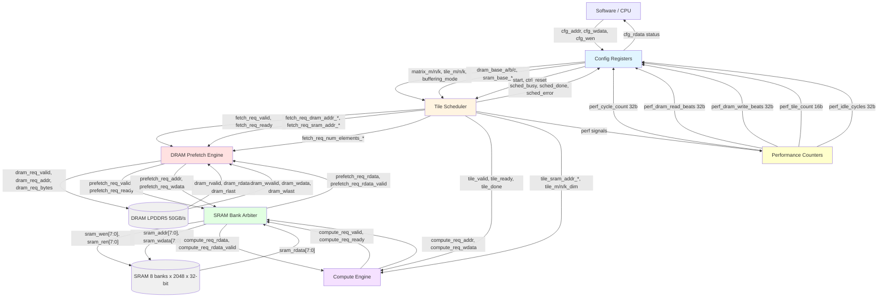
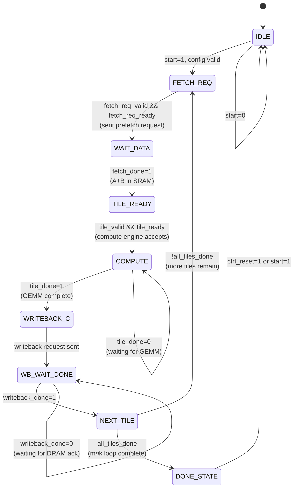
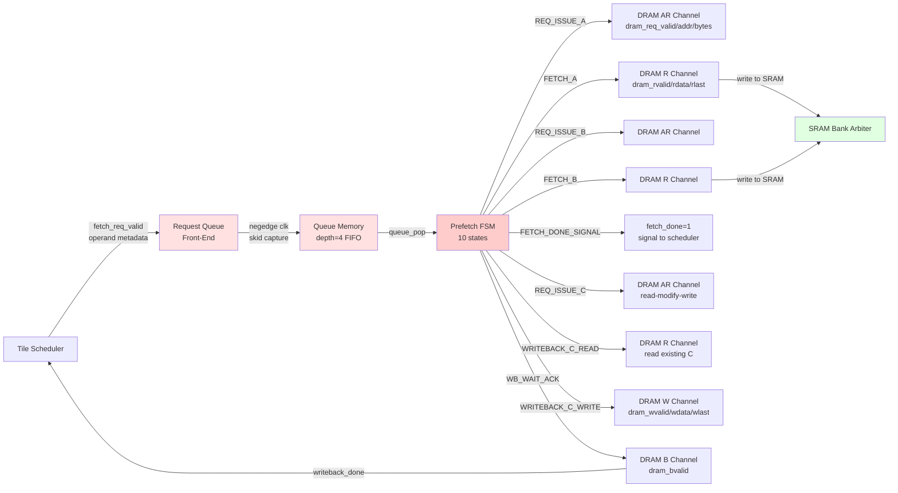

# LLM Memory Controller Architecture

This document provides architectural diagrams for the `lm_memory_controller` — a synthesizable memory-subsystem IP optimized for edge LLM inference.

## Overview

The controller coordinates GEMM tiling, DRAM prefetching, and SRAM bank arbitration for memory-bound Transformer inference on edge SoCs (2 MB SRAM, 50 GB/s LPDDR5 DRAM, INT4/INT8 quantized models).

---

## 1. System Block Diagram



**Key Components:**
- **Config Registers**: APB-like interface for software to configure matrix dimensions, tile sizes, buffering mode (SINGLE/DOUBLE_A/DOUBLE_B/DOUBLE_AB), and DRAM/SRAM base addresses
- **Tile Scheduler**: FSM-based GEMM tiling coordinator — generates fetch requests, tracks tile progress, signals compute engine
- **DRAM Prefetch Engine**: Request queue (depth 4) + FSM to fetch A/B operands, writeback C results via AXI-like DRAM interface
- **SRAM Bank Arbiter**: 2-requestor (prefetch, compute) × 8-bank arbiter with 2-cycle read latency pipeline
- **Performance Counters**: Observational metrics — cycle count, DRAM read/write beats, tile count, idle cycles (reset on start/ctrl_reset, freeze when sched_done)

---

## 2. Tile Scheduler FSM



**State Descriptions:**
- **IDLE**: Waiting for software START command
- **FETCH_REQ**: Issue prefetch request for next tile's A/B operands (with ping-pong buffer selection if double-buffering enabled)
- **WAIT_DATA**: Wait for DRAM prefetch engine to signal `fetch_done`
- **TILE_READY**: Assert `tile_valid` to compute engine with SRAM addresses and tile dimensions
- **COMPUTE**: Wait for compute engine to assert `tile_done` after GEMM completion
- **WRITEBACK_C**: Issue writeback request for accumulated C result
- **WB_WAIT_DONE**: Wait for writeback acknowledgment from prefetch engine
- **NEXT_TILE**: Increment tile counters (m_tile, n_tile, k_tile in row-major order), check if all tiles complete
- **DONE_STATE**: Assert `sched_done`, wait for reset or new job

**Tiling Loop**: 3-level nested loop (k innermost, n middle, m outermost) — tiles processed in order: `(0,0,0), (0,0,1), ..., (0,0,K-1), (0,1,0), ..., (M-1,N-1,K-1)`

---

## 3. DRAM Prefetch Engine Pipeline



**Pipeline Stages:**

1. **Request Queue Front-End** (Negedge Skid Capture):
   - Captures `fetch_req_*` signals on **negedge clk** to avoid Verilator posedge race
   - Generates `queue_push` on rising edge of `neg_req_valid` (edge-triggered, prevents duplicate enqueue)
   - Fixes test2 bug where level-sensitive logic enqueued stale metadata

2. **Queue Memory** (FIFO depth=4):
   - Separate arrays for Yosys synthesis compatibility
   - Stores: `is_write`, `dram_addr_a/b/c`, `sram_addr_a/b/c`, `num_elements_a/b/c` per request

3. **Prefetch FSM** (10 states):
   - **REQ_IDLE**: Pop from queue when not empty
   - **REQ_ISSUE_A → FETCH_A**: Issue DRAM read for operand A, stream to SRAM via arbiter
   - **REQ_ISSUE_B → FETCH_B**: Issue DRAM read for operand B, stream to SRAM via arbiter
   - **FETCH_DONE_SIGNAL**: Assert `fetch_done` pulse to scheduler
   - **REQ_ISSUE_C → WRITEBACK_C_READ → WRITEBACK_C_WRITE → WB_WAIT_ACK**: Read existing C from DRAM (for accumulation), write updated C, wait for write ack

**DRAM Interface**: AXI-like split channels (AR=address read, R=read data, W=write data, B=write response)

---

## 4. SRAM Bank Arbiter Datapath

```mermaid
flowchart TD
    PREFREQ[Prefetch Request<br/>prefetch_req_valid<br/>prefetch_req_addr<br/>prefetch_req_wen] --> MUX1{Round-Robin<br/>Arbitration}
    
    COMPREQ[Compute Request<br/>compute_req_valid<br/>compute_req_addr<br/>compute_req_wen] --> MUX1
    
    MUX1 -->|selected request| DECODE[Bank ID Decode<br/>addr[15:11] → bank_id[2:0]]
    
    DECODE -->|bank conflict check| CONFLICT{Bank<br/>Available?}
    
    CONFLICT -->|conflict| BACKPRESS[Assert NOT ready<br/>stall requestor]
    CONFLICT -->|available| GRANT[Grant access<br/>assert ready]
    
    GRANT -->|write: sram_wen=1| WREQ[SRAM Write<br/>sram_addr, sram_wdata]
    GRANT -->|read: sram_ren=1| RREQ[SRAM Read<br/>sram_addr]
    
    RREQ -->|Stage 0: accept| STAGE0[Latch bank_id<br/>pf_bank_d0 / cp_bank_d0]
    STAGE0 -->|Stage 1: delay +1 cycle| STAGE1[Pipeline delay<br/>pf_acc_d1 / cp_acc_d1]
    STAGE1 -->|Stage 2: delay +1 cycle| STAGE2[Pipeline delay<br/>pf_acc_d2 / cp_acc_d2]
    
    STAGE2 -->|capture sram_rdata| RCAP[Capture rdata<br/>pf_rdata_reg / cp_rdata_reg]
    STAGE2 -->|assert valid| RVALID[Assert rdata_valid<br/>prefetch/compute_req_rdata_valid]
    
    RCAP --> PREFREQ
    RVALID --> PREFREQ
    RCAP --> COMPREQ
    RVALID --> COMPREQ
    
    style MUX1 fill:#e1ffe1
    style DECODE fill:#e1ffe1
    style CONFLICT fill:#fff4e1
    style GRANT fill:#ccffcc
    style STAGE0 fill:#cce5ff
    style STAGE1 fill:#cce5ff
    style STAGE2 fill:#cce5ff
    style RCAP fill:#99ccff
    style RVALID fill:#99ccff
```

**Arbitration Logic:**
- **2 Requestors**: Prefetch engine (for DMA) + Compute engine (for GEMM operand access)
- **8 Banks**: Each bank independently arbitrated based on decoded bank ID from address bits `[15:11]`
- **Round-Robin Priority**: Fair arbitration between prefetch and compute when both request same bank
- **Bank Conflict Handling**: Assert `NOT ready` on conflicting requestor, grant to higher-priority one

**Read Pipeline** (3-stage, 2-cycle latency):
- **Stage 0** (accept cycle): Latch `bank_id` when request accepted (`pf_acc` / `cp_acc`)
- **Stage 1** (delay +1): Pipeline delay for SRAM registered output to update
- **Stage 2** (delay +2): Capture `sram_rdata[bank_id]` and assert `rdata_valid`
- **Fix applied**: Added 3rd stage to avoid Verilator posedge race (SRAM updates output on same edge arbiter was sampling with 2-stage design)

**Write Path**: Single-cycle — write data directly to SRAM when `sram_wen` asserted (no pipeline delay)

---

## Performance Counters

5 observational metrics exported via top-level ports (readable via config register interface in future iterations):

| Counter | Width | Description |
|---------|-------|-------------|
| `perf_cycle_count` | 32-bit | Total cycles since START (freezes on `sched_done`) |
| `perf_dram_read_beats` | 32-bit | DRAM read beats (increments when `dram_rvalid && dram_rready`) |
| `perf_dram_write_beats` | 32-bit | DRAM write beats (increments when `dram_wvalid && dram_wready`) |
| `perf_tile_count` | 16-bit | Completed tiles (increments on `tile_done` from compute engine) |
| `perf_idle_cycles` | 32-bit | Cycles where scheduler is busy but no DRAM transfer or tile issue |

**Reset**: Counters reset on `start || ctrl_reset`  
**Freeze**: Counters freeze when `!sched_done` is false (i.e., when GEMM complete)

---

## References

- **RTL Modules**: `lm_memory_controller_Cognichip/rtl/*.sv`
- **Testbenches**: `lm_memory_controller_Cognichip/tb/tb_*.sv`
- **Analytical Model**: `analytical_model/*.py` (sweep.py, cost_model.py)
- **Project Goals**: `AGENTS.md`
